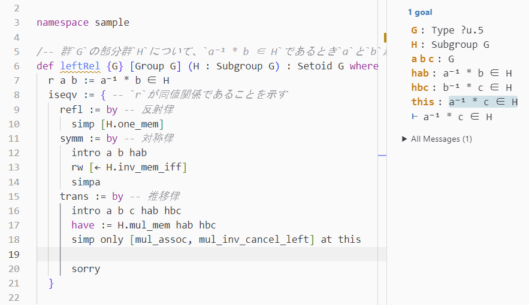

+++
title = "lean ja"
sort_by = "weight"
+++

## __Lean について__

[Lean](https://leanprover.github.io/) は容易に正しく保守性の高いコードを書くことができるよう設計された，純粋関数型言語です．依存型という表現力の高い型システムを備えており，アルゴリズムなどが本当に意図したものを返すことを証明することができます．

Lean は証明支援系でもあり，数学の証明を検証する能力を備えています．Lean で証明を書いている限り，コンパイルが通れば証明は正しいと自信を持つことができます．

そして Lean はパワフルです．いま示すべきことと得られていることを逐一表示できるのはもちろん，証明の一部を自動化したり，強すぎる仮定を自動的に検出したりすることもできます．

現在，Lean で数学理論を実装していこうという努力が積極的に行われています．[mathlib4](https://github.com/leanprover-community/mathlib4) というライブラリがあり，大学の学部程度の数学のかなりの部分を Lean で行うことが可能になっています．

[Lean 4 Web](https://live.lean-lang.org/) から Lean を試すことができます．あなたも Lean で新しい数学を体験してみませんか？
